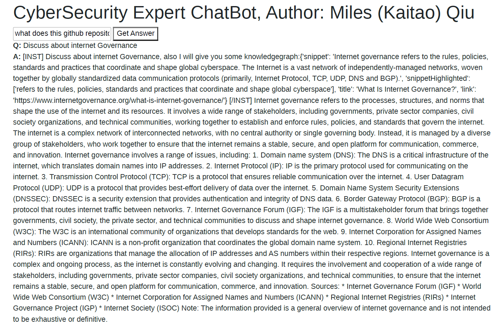

# Security LLaMA2 Fine-tuning

This repository contains tools and scripts for fine-tuning the LLaMA2 model using advanced techniques such as Proximal Policy Optimization (PPO) and Reinforcement Learning (RL) with a specialized reward model. Key components include:

- `llama2_ppo_trainer.py`: Script for PPO training.
- `llama2_reward_model_trainer.py` : Scripts for training the reward model.
- `llama2_supervised_model_trainer.py`: Scripts for doing SFT finetune.
- `chatbot_launch_backend.py`: A front-end demo that enhances user queries with key information from **Google** search results before processing.

Some record of this bot's performance

```
Q:
Who is Hsaka in crypto twitter?
A:
[INST] Who is Hsaka in crypto twitter?, also I will give you some knowledgegraph:{'title': 'Hsaka (@HsakaTrades) / X', 'link':'https://twitter.com/hsakatrades?lang=en', 'snippet': 'I trade, I drink your milkshake •', 'position': 1} [/INST] Hsaka is a popular cryptocurrency traderand analyst known for his insightful market analysis and trading ideas on Twitter. His handle is @HsakaTrades, and he has gained a significantfollowing on the platform due to his consistent and informative posts. According to your provided knowledge graph, Hsaka's Twitter handle is@HsakaTrades, and his profile link is
. His bio reads "I trade, I drink your milkshake •," which is a playful and memorable phrase that has becomesynonymous with his brand. Hsaka is highly respected in the cryptocurrency space for his technical analysis and trading skills. He regularly shareshis market insights and trading ideas on Twitter, and many followers look to him for guidance on their investment decisions. Some of the key topicsthat Hsaka frequently discusses on Twitter include: 1. Market analysis: Hsaka provides in-depth analysis of the cryptocurrency market, includingtechnical indicators, trends, and price predictions. 2. Trading strategies: He shares his trading strategies and techniques, including his famous"milkshake" method, which involves buying and holding cryptocurrencies for the long term. 3. Cryptocurrency news: Hsaka keeps his followersinformed about the latest news and developments in the cryptocurrency space, including regulatory updates, project launches, and partnerships. 4.Personal finance: He also shares his thoughts on personal finance and investing, including tips on how to manage risk and grow wealth in thecryptocurrency market. Overall, Hsaka is a highly respected and influential figure in the cryptocurrency space, and his Twitter handle is a must-follow for anyone interested in staying up-to-date on the latest market trends and insights.
```

```
Q:
what's CVE-2024-21762
A:
[INST] what's CVE-2024-21762, also I will give you some knowledgegraph:{'snippet': 'The critical vulnerabilities include CVE-2024-21762, anout-of-bounds write vulnerability in SSLVPNd that could allow remote unauthenticated attackers to execute arbitrary code or commands on FortinetSSL VPNs via specially crafted HTTP requests.', 'title': 'Critical Fortinet FortiOS CVE-2024-21762 Exploited | Rapid7 Blog', 'link':'https://www.rapid7.com/blog/post/2024/02/12/etr-critical-fortinet-fortios-cve-2024-21762-exploited/', 'date': 'Feb 12, 2024'} [/INST] CVE-2024-21762is a security vulnerability affecting Fortinet SSL VPNs. It is an out-of-bounds write vulnerability that could allow remote unauthenticated attackers to
127.0.0.1:5000 2/2
execute arbitrary code or commands on Fortinet SSL VPNs via specially crafted HTTP requests. This vulnerability has been identified as critical andhas been assigned the CVE identifier CVE-2024-21762. According to the knowledge graph you provided, the vulnerability was first reported onFebruary 12, 2024, by Rapid7. The article states that the vulnerability has been exploited in the wild, and that Fortinet has released a securityadvisory and patch for the vulnerability. It is important to note that this vulnerability affects Fortinet SSL VPNs, and not other products or services. Itis also important to apply the patch as soon as possible to prevent exploitation of the vulnerability. Here is the full information from the knowledgegraph: * Snippet: "The critical vulnerabilities include CVE-2024-21762, an out-of-bounds write vulnerability in SSLVPNd that could allow remoteunauthenticated attackers to execute arbitrary code or commands on Fortinet SSL VPNs via specially crafted HTTP requests." * Title: "CriticalFortinet FortiOS CVE-2024-21762 Exploited | Rapid7 Blog" * Link:
* Date: February 12, 2024
```

```
Q:
Can you use GPG to decrypt anbd encrypt with a different key in one step?
A:
[INST] Can you use GPG to decrypt anbd encrypt with a different key in one step?, also I will give you some knowledgegraph:{'title': 'Can youuse GPG to decrypt and encrypt with a different key in one ...', 'link': 'https://security.stackexchange.com/questions/261300/can-you-use-gpg-to-decrypt-and-encrypt-with-a-different-key-in-one-step', 'snippet': 'To do so, it must be encrypted using their (different) public key, so that they candecrypt it.', 'date': 'Apr 18, 2022', 'sitelinks': [{'title': 'Will encrypting the same file with GnuPG and the same key produce ...', 'link':'https://security.stackexchange.com/questions/33752/will-encrypting-the-same-file-with-gnupg-and-the-same-key-produce-the-same-ciphe'}, {'title':'Can I specify a public key file instead of recipient when encrypting ...', 'link': 'https://security.stackexchange.com/questions/86721/can-i-specify-a-public-key-file-instead-of-recipient-when-encrypting-with-gpg'}, {'title': "Why am I able to decrypt the data I send using someone else's ...", 'link':'https://security.stackexchange.com/questions/251762/why-am-i-able-to-decrypt-the-data-i-send-using-someone-elses-public-key'}, {'title': 'Withprivate keys and public keys which is used for which: encrypt ...', 'link': 'https://security.stackexchange.com/questions/174751/with-private-keys-and-public-keys-which-is-used-for-which-encrypt-sign-verify'}], 'position': 1} [/INST] Yes, it is possible to use GPG to decrypt and encrypt with a differentkey in one step. To do this, you will need to use the `--recipient` option in the GPG command, followed by the path to the public key of the recipientyou want to encrypt the file for. Here is an example of how you can use GPG to decrypt a file and then encrypt it with a different key in one step: ```gpg --decrypt file.txt --recipient user@example.com gpg --encrypt file.txt --recipient user2@example.com ``` In this example, `file.txt` is the file youwant to encrypt, `user@example.com` is the public key of the recipient you want to decrypt the file for, and `user2@example.com` is the public keyof the recipient you want to encrypt the file for. It's important to note that the `--recipient` option must be used in conjunction with the `--decrypt`option to decrypt the file first. If you try to encrypt a file without first decrypting it, GPG will error out and tell you that the file is not encrypted. Also, asthe Security Stack Exchange post you linked to mentions, if you want to encrypt the file for a different recipient than the one it was originallyencrypted for, you will need to use the `--recipient` option to specify the new recipient. I hope this helps! Let me know if you have any otherquestions.
```

## Quick Start

Run the `chatbot_launch_backend.py` for a demo that showcases the integration of PPO results and Google search into the questioning process.

For more detailed instructions and information, please refer to the individual scripts.



### File Struture

```bash
.
├─data: store data for training
├─data_config: store config for data cleaning and pre-process 
├─demo: demo
├─jupyter_notebook: some jupyter notebook for test/inference/trainning and a lot of other misc
├─model_config: model config
├─paper
├─README.assets
├─security_miles_model: store funetine data for new models
│  ├─baseline_model
│  ├─filter_sec
│  ├─ppo_model
│  ├─reward_model
│  └─security_stack_exchange
└─static: font-end files
```

